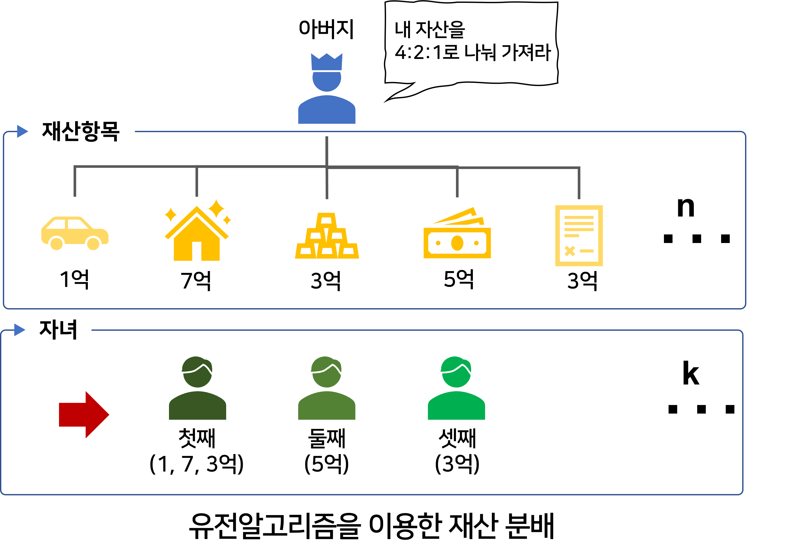

# propertyDistribution
유전 알고리즘을 이용한 재산 분배

  

## 🛰 프로젝트 설명

> 아버지는 자신의 재산을 장남, 차남,삼남에게 4:2:1 비율로 물려준다 유언을 남기셨다. 
자산 가치가 다른 각 재산을 유언의 비율대로 나누려 한다. 
최고로 가장 비율에 맞게끔 재산을 분배하려면 어떤 재산을 누구에게 주어야할까?  
ex) 삼형제에게 1, 2, 3, 4, 5, 6, 7억의 자산 가치를 가진 재산을 4:2:1 비율로 나누는 최적의 방안은?  

     

### 조건 
 - 각 세대 유전자 수 : 128 (고정)
 - 최대 진화 세대 수 : 5000(고정)
 - 하나의 유전자 길이 : 재산의 수(가변)
 - 배수 세대에서 중간 결과 출력 : 500  

 - 최종 출력 : 최고적응도, 최종 배분 결과 – 1번 자산은 3번자식, 2번 자산은 5번 자산

      

### 결과

 > 📌 코드작성에 2시간 밖에 투자할 수 없어 출력이 아름답지 못합니다.

 

 - 출력 형태 : 세대, 적응도, 재산분배 결과
 - 적응도? : |정답 - 개체값|의 합
 - 재산분배 결과? : [0, 1, 2, 1, 2]
    - 0번 재산은 첫째에게, 1번 재산은 둘째에게, 2번 재산은 셋째에게, 3번재산은 둘째에게, 4번 재산은 셋째에게
 

      

## 👩‍🏫 유전 알고리즘의 개념 : 세대교체

### 세대교체의 3가지 실행 단계
    - ① 선택 : 개체 중에서 적응도가 높은 것을 선택.
    - ② 교차 : 그 유전자들 간에 유전자 일부를 교환하여 보다 적응도가 높은 유전자를 갖는 개체를 만들어 냄.
    - ③ 돌연변이 : 진화가 정체되지 않게 가끔 새 유전자를 추가함.

 - 적응도  : 유전자 설계와 동시에 해로서의 가치를 평가하는 지표
    - |정답 - 개체값|의 합
    
      

### 세부 개념
 - 유전자(Gene)
  : 대상 문제의 특징을 추출하여 세대교체의 대상이 되는 기호 열
 - 적응도(Fitness)  : 대상 문제에서 요구되는 가치에 얼마나 근접한지를 나타내는 지표
 - 선택(Selection)  : 많은 개체들로부터 적응도가 높은 것을 선택해 내는 방법
 - 교차(Crossover)  : 개체 간에 유전자를 교환하는 방법
 - 돌연변이(Mutation)  : 적응도에 관계없이 임의로 유전자를 끼워 넣는 방법
 
       

## 🤹‍♀ 적용 기법

### 선택 : 엘리트 보존법(Elitism)
  - 정의 : 현 세대에의 적응도가 가장 높은 것은 교차, 돌연변이를 수행하지 않고 다음 세대에 그대로 물려 주는 것
  - 요약 : 현재까지 제일 좋은 개체는 변형하지 말자.
  - 새로운 제일 좋은 친구가 나오면 그 친구를 보존
  
    
  
### 교차 : 단순 교차

 - 단순교차(일점 교차) : 한 번 자름
 - 다점교차 : 다점이지만 2군데 자름
 - 균등교차 : 마스크 패턴을 이용해 바꿀 곳1, 안 바꿀 곳 0으로 설정
 
  \* 위 기법은 순서에 영향을 받지 않는 기법

  

### 돌연변이
 - 일정 확률로 뽑아서 임의 위치에 임의값 설정
